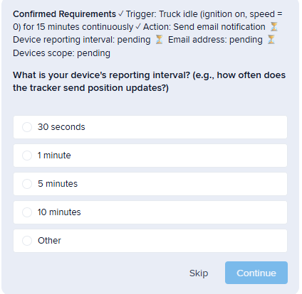
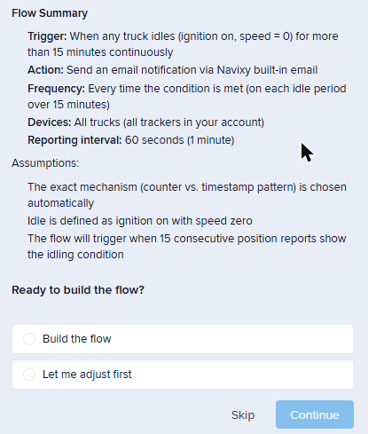
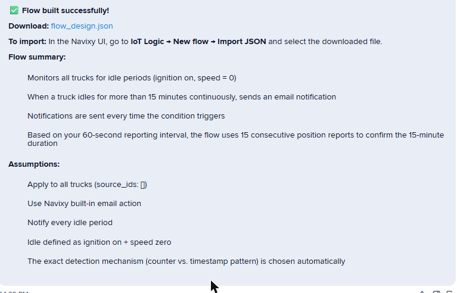

# IoT Logic Flow Builder

The IoT Logic Flow Builder lets you create an IoT Logic flow by describing the automation you want in plain language, instead of building the node graph yourself on the canvas. The assistant interviews you about the details, generates a ready-to-import flow file, and hands it back for you to review and upload.

This page is for fleet managers, dispatchers, and operators who have an active Navixy account. It walks through what you can build, how to run a build, how to import the result, and what the builder handles automatically.

## What you can build and how it works

The result is a `flow_design.json` file that you import into IoT Logic. No JEXL knowledge or node-graph experience is required.

Because IoT Logic flows react to telemetry, the builder works within that model. Triggers are based on the parameters your devices report, such as ignition state, speed, battery level, or geofence entry and exit. Flows can't be triggered by external events, timers, delays, schedulers, or loops.

When a trigger fires, a flow can do one of the following:

* Activate a device output.
* Send a command to the device.
* Send a webhook. Webhooks are output-only: the flow sends them, but they can't start a flow.
* Publish via MQTT.
* Send a notification through push, email, SMS, Telegram, or a webhook channel.

Each build produces one flow. If you describe several independent automations at once, the assistant asks you to split them into separate requests.

## Before you start

Open the assistant from inside the Navixy interface so it connects to your account automatically. Authentication is handled for you, and the assistant never asks for a token, key, or password.

Building flows and reading your account data both depend on that signed-in session. If you open the assistant outside it, the assistant can still answer how-to questions from the documentation, but it can't build flows.


If your automation involves a geofence (for example, "when a vehicle enters Main Depot"), create that zone in Geofences first and note its exact name. The builder matches geofences by name and can't create new zones for you.


## Build a flow step by step

Once you're in the assistant, start a build by describing the automation you want. Any of these phrasings work:

* "Create a flow that emails me when a truck idles for over 15 minutes."
* "Alert me when speed goes above 100 km/h."
* "Turn on output 2 when ignition switches on."

From there, the assistant asks one question at a time, so the interview stays focused. It usually takes around four exchanges. As you answer, a **Confirmed requirements** checklist tracks what's locked in and what's still pending, so you can always see where you are.

<figure><figcaption>
An interview question, with the Confirmed requirements checklist above it.
</figcaption></figure>

Most questions appear as a clickable widget with sensible presets, and you can type your own value when the presets don't fit. Over the interview, the assistant settles these details:

* **Trigger:** The event or condition that activates the flow (for example, ignition on, speed over a threshold, entering or leaving a geofence, low battery).
* **Action:** What happens when the condition is met.
* **Else branch:** What happens when the condition is not met. The most common answer is "nothing."
* **Combinator:** When your trigger has two or more conditions, whether all of them must be true (AND) or any of them (OR).
* **Duration:** If the trigger is "for N minutes or hours," the assistant also asks how often your devices report so it can calculate the timing correctly.
* **Device scope:** Which devices the flow applies to: all devices, a specific group, or specific ones. If your description makes the scope clear, the assistant assumes all devices and tells you.

For a full run-through, expand the worked example.

Worked example: email alert for idle vehicles

Goal: notify by email when any truck idles for more than 15 minutes.

1. Type: "Create a flow that emails me when a truck idles for over 15 minutes."
2. The assistant asks how often your devices report. Select or enter the reporting interval, for example 1 minute.
3. The assistant asks how to send the email. Select an email method.
4. The assistant asks for the recipient address. Enter the email address.
5. The assistant asks how often to send the alert. Select **Every time**.
6. The assistant shows a flow summary with the trigger, action, frequency, devices, and any assumptions it made.
7. Click **Build the flow** to generate the flow file.
8. The assistant returns a download link for `flow_design.json` and a note on how to import it.

<figure><figcaption>
The flow summary, with the Build the flow and Let me adjust first options.
</figcaption></figure>

Nothing is built until you click **Build the flow**. If the summary isn't right, click **Let me adjust first** to change a specific detail before generating.

## Import the generated flow

When the build finishes, the assistant returns a download link for `flow_design.json`, available for 7 days. Importing the file is a manual step that keeps you in control: you review the generated flow on the canvas before it goes live.

<figure><figcaption>
The build result: a flow_design.json download link with the flow summary and assumptions.
</figcaption></figure>

To import the flow into your account, follow these steps:

1. Download `flow_design.json` from the link the assistant provided.
2. Open IoT Logic. The start page shows the **Created flows** table.
3. Click **Upload Flow**.
4. Select the `flow_design.json` file.
5. Review the imported flow structure on the canvas.
6. Assign devices to the Data Source nodes.
7. If the flow uses Webhook nodes, add the authentication headers.
8. If the flow uses MQTT output nodes, enter the MQTT credentials.
9. Click **Save flow** and enable the flow.

For detailed import instructions, see [importing and exporting flows](https://app.gitbook.com/s/446mKak1zDrGv70ahuYZ/guide/account/iot-logic/flow-management) in the IoT Logic documentation.


Building a flow doesn't change anything in your account. Device selections and credentials are deliberately left out of the generated file, which is why you add them during import.


## What the builder handles automatically

The walkthrough above is the main path. Along the way, the builder also takes care of a few things on its own, so you don't have to spell them out:

| Behavior                | What the builder does                                                                                                                                                                                                                                 |
| ----------------------- | ----------------------------------------------------------------------------------------------------------------------------------------------------------------------------------------------------------------------------------------------------- |
| **Geofence matching**   | When a trigger names a geofence in plain language, such as "when a vehicle enters Main Depot," the builder matches the name to the actual zone in your account, so you never use numeric zone IDs.                                                    |
| **Duration timing**     | When a trigger depends on a duration, such as "idle for more than 15 minutes," the builder asks how often your devices report and then chooses the timing mechanism for you. You describe durations in plain terms and don't deal with report counts. |
| **Safety confirmation** | For an action that controls a safety-critical actuator (engine block, fuel cutoff, brake control, or a transmission or steering lock), the builder doesn't generate the flow until you confirm that you understand the risk.                          |
| **Interview language**  | The builder runs the interview in your language, for example English, Russian, or Spanish. Technical terms such as node types, parameter names, and action types stay in English to match the IoT Logic interface.                                    |

## Limits

Two limits apply to the builder:

* **Daily build limit:** 10 successful flow builds per day. If you reach the limit, the assistant tells you and asks you to try again the next day.
* **Download link lifetime:** the download link for a generated flow is available for 7 days.

## See also

* [Navixy AI Assistant](./): overview of all assistant capabilities, including account queries and how-to help
* [IoT Logic overview](https://app.gitbook.com/s/446mKak1zDrGv70ahuYZ/guide/account/iot-logic): what IoT Logic is and how it works
* [IoT Logic quick start guide](https://app.gitbook.com/s/446mKak1zDrGv70ahuYZ/guide/account/iot-logic/quick-start-guide): build your first flow manually on the canvas
* [IoT Logic nodes reference](https://app.gitbook.com/s/446mKak1zDrGv70ahuYZ/guide/account/iot-logic/nodes): reference for all node types and their configuration
* [Importing and exporting flows](https://app.gitbook.com/s/446mKak1zDrGv70ahuYZ/guide/account/iot-logic/flow-management): **Upload Flow**, export, and the full import procedure
