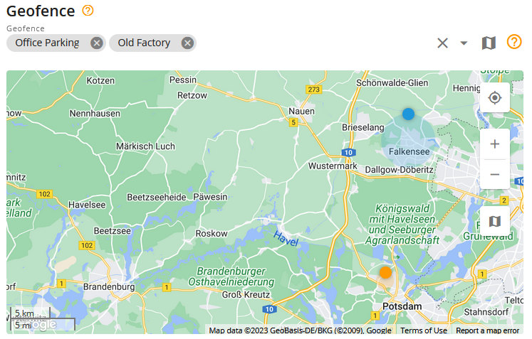

# Geofence entrance or exit

A geofence is a designated area on a map that acts as a virtual boundary. This rule tracks when GPS devices enter or exit the specified geofence area. Users receive notifications whenever their objects cross these geofence borders. For example, if a piece of building machinery leaves the designated zone, a company employee can be notified through the user interface, email, or SMS if configured in the rule.

This functionality provides valuable insights and control over the movement of objects, ensuring adherence to predefined boundaries. It enhances security by alerting users to any unauthorized movement or potential theft outside the specified geofence area. Additionally, it enables efficient asset management by allowing users to track and optimize the utilization of their equipment within designated zones.

## Rule settings

### Geofences

Specify the geofences that trigger notifications when crossed. You can list multiple geofences within a single rule.

For common settings, see [Rules and Alerts](../).

## System operation details

* The "Geofence entrance or exit" alert has a 60-second reset timer, which means the alert won't trigger more often than once every minute. If an event occurs while the rule is waiting for the reset, the Navixy platform omits the event, including in reports.
* This rule is processed in the cloud and isn't tied to any specific hardware, allowing it to be applied to multiple GPS devices simultaneously. This flexibility enables you to manage several GPS devices within a single rule.
* Note that the system may generate an entrance/exit alert even if GPS drifting occurs. Although invalid GPS coordinates are filtered, small GPS drifts can still appear in the track. Various methods to prevent GPS drifting events are available, depending on the GPS device model's functionality. For details on preventing GPS drifting, see the device manual.
