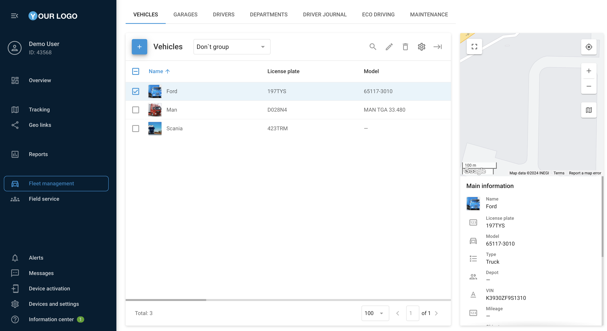

# Fleet management

The **Fleet management** section in the Navixy platform gives you detailed insight into and control over your organization's vehicles, from fuel consumption to vehicle specifications, to help improve operational efficiency.

All information about your organization's vehicles lives in **Fleet management**. For example, you enter fuel consumption per 100 km (or miles), and the Navixy platform uses this rate to estimate fuel usage and compare it with the actual readings.

## Section content

* [**Vehicles**](vehicles.md): Add and edit vehicle profiles with specifications, fuel consumption rates, and insurance details, link them to GPS devices, and import multiple profiles from an Excel file.
* [**Garages**](garages.md): Create garage (depot) profiles that store location, mechanic, and dispatcher details for multi-site fleet coordination.
* [**Drivers**](drivers.md): Manage driver profiles and set up automatic or manual driver identification.
* [**Departments**](departments.md): Group vehicles and drivers into departments for easier organization.
* [**Driver journal**](driver-journal.md): Classify trips as business or private and review trip data.
* [**Eco Driving**](eco-driving.md): Review driver safety scores based on speeding, harsh driving, and idling.
* [**Maintenance**](maintenance.md): Schedule one-time and repeatable service tasks and track their status.
