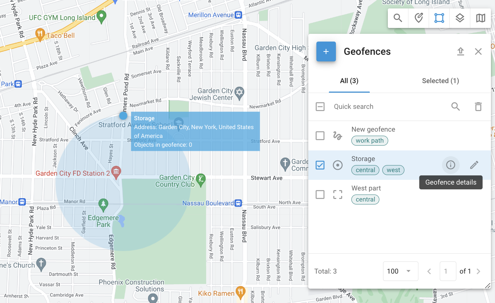
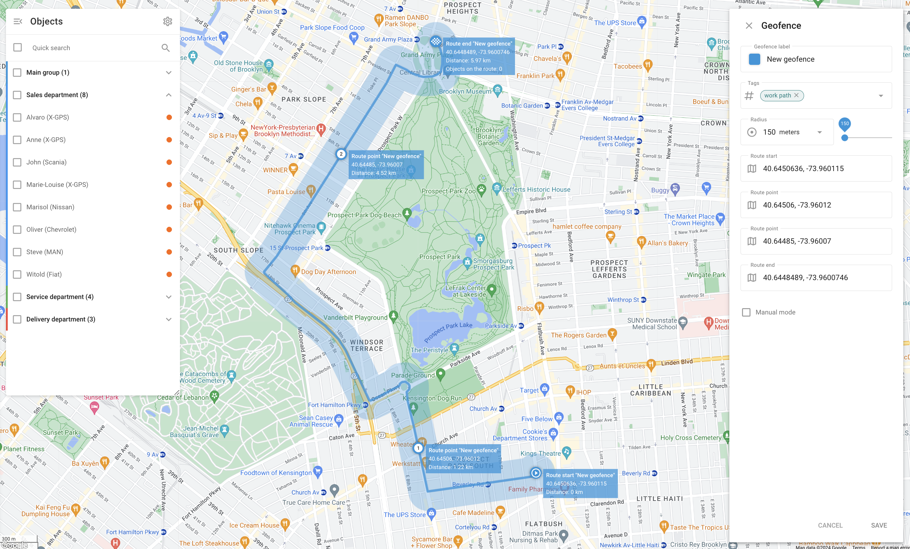
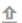
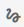

# Geofences

Geofences are virtual perimeters that allow the Navixy platform to monitor whether an object has crossed the geofence border ("in" or "out"). The Navixy platform logs these events, so you can generate geofence reports and [receive alerts](../../events-and-notifications/movement-monitoring/geofence-entrance-or-exit.md). You can also link geofences to specific [Rules and alerts](../../events-and-notifications/) for particular areas. For example, you can receive speeding alerts only within a city or along a route.

To access the **Geofences** tool, click  in the upper-right corner of the map. Selecting any of the geofences displays the objects currently located within its borders.

## Types of geofences

Three types of geofences are available:

* A **circular geofence** is a geographic area with a given center and a circular shape with a minimum radius of 50 meters. Users can define the radius and center of the circle.
* A **polygonal geofence** is an area defined by an arbitrary polygon with up to 500 vertices. The multiple vertices let you create complex shapes. This type is useful for accurately defining irregularly shaped areas. Examples include neighborhoods, parks, and any zones that don't fit a simple circular boundary.
* A **route geofence** creates a virtual perimeter between two or more points. This type of geofence is well-suited for monitoring [adherence to planned routes](../../events-and-notifications/scheduling-and-dispatching/deviation-from-the-route.md) and ensuring that vehicles don't deviate from their intended path. The route geofence uses a series of points to create a continuous route. A specified radius determines the allowable deviation from the path.

## Creating, editing, and deleting geofences

### How to create a geofence

To create a geofence, follow these steps:



#### Locate the desired area on the map

Use **Quick search**.



#### Open the Geofences tool

Click  in the top-right corner of the map.



#### Select geofence type

Hover the cursor over the  button and select the geofence you want to create:

* **Circle**:
  1. Drag the circle over the map to set its location.
  2. Use the resize handle on its border to adjust its size. You can also adjust it manually in the **Radius** menu. The drop-down list contains several common options for quick selection.
* **Polygon**:
  1. Start with a pentagon.
  2. Adjust it by dragging vertices or adding new ones.
* **Route**:
  1. Select the start and end points. The Navixy platform builds the route.
  2. Add more route points by clicking and dragging adjustment handles along the route.
  3. Set the radius. Radius determines how far the object can deviate from the path before route deviation is detected. The drop-down list contains several common options for quick selection.
  4. If needed, activate manual mode to adjust the points manually for precise control over the path.



#### Name your new geofence

Enter the name of the geofence into the **Geofence label** field.



#### Select color

Choose the color for better visualization on the map. This is particularly useful when managing multiple geofences, as different colors can quickly differentiate between various zones. The color selection tool allows setting a specific color and viewing its HEX code.



#### Use tags

Add or modify tags to categorize and organize geofences. Tags like "Central" and "West" help in sorting and managing multiple geofences.



#### Save the geofence



### How to edit a geofence

To edit a geofence, click  next to the geofence you want to edit in the **Geofences** tool. When editing a geofence, you can adjust the same fields as during its creation.\
For the description of those fields, see [Creating geofences](geofences.md#creating-geofence).

### How to delete a geofence

To delete a geofence, select it and click  in the top-right corner next to **Quick search**.


Only geofences not included in any **Alert** rules can be deleted. To remove the geofence from an **Alert** rule, go to **Alerts** → **Set rules** and select the rule that contains the geofence. Open the **Settings** tab and click ⨂ next to the geofence name.


## Geofence details

To see details about the selected geofence, click  next to it.

* **Tags**: Tags associated with the geofence, such as "Central," help categorize and organize geofences for easy identification and management.
* **Location**: The geographic location of the geofence, such as "Queens County, New York, United States of America."
* **Objects**: A list of objects within the geofence.

## Importing geofences

When you need to add a large number of geofences, it’s quicker to import them from a file rather than creating them manually. You can import geofences from Excel or KML files.

### How to import circle geofences from Excel

1. Open the **Geofences** tool.
2. Click the  (**Circle geofences import)** button.
3. Download the provided Excel template and fill it in or create a file with the fields listed in the dialogue window (required and optional). Column names in the template change depending on the language settings in your [profile](../../account/profile.md).
4. Save your file.
5. Click **Browse,** navigate to your file, and upload it.
6. Click **Continue,** preview your list, and change the column names if necessary.
7. Click **Continue** to proceed. The Navixy platform will validate your table and display any errors. You can also view the errors in CSV format by clicking **Download error rows.**
8. If your file is correct, you will see a success message. Click **Finish import**, and your geofences will appear on the list.

### How to import polygonal geofences from KML

1. Open the **Geofences** tool.
2. Hover the cursor over the  button and click the  (**Geofences import from KML**) button.
3. Click **Browse** to select the KML file on your computer.
4. Change the default radius if necessary.
5. Click **Upload**.
6. Once the import is completed, the new geofences appear in the list. Note that the default radius is only used for route geofences. For other types, this step can be skipped.

## Exporting geofences

To export your geofences into a KML file for further use, follow these steps:

1. Open the **Geofences** tool.
2. Click  on the tool panel.
3. Download the KML file for further use.


Every geofence has a 500-point limit.

