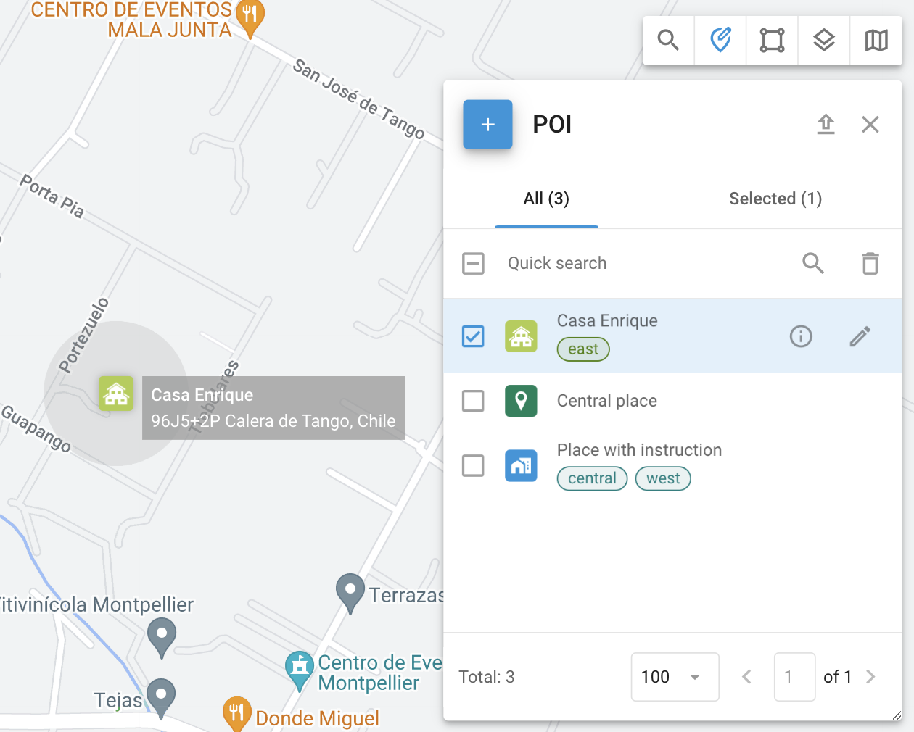

# Places (POIs)

Places, also known as Points of Interest (POI), are an essential feature of fleet management and asset tracking. Organizations can create a detailed list of Places, including key locations like offices and warehouses, as well as numerous sites crucial for logistics operations. Places improve operational efficiency by optimizing route planning and streamlining task assignments for field employees.

To access the **Places** tool, click  in the toolbar in the top-right corner of the map.

## POI use cases

* Finding locations: Quickly find a Place by typing its name or tag in **Quick search**.
* Creating POIs: Use Places to mark important locations on the map.
* Assigning tasks: Simplify task assignment by using Place names instead of full addresses.

## Creating and editing Places

### How to create a Place

To create a Place, follow these steps:

1. Open the **Place** tool by clicking  in the top-right corner of the map.
2. Click  to open the Place creation form.
3. Assign it a name such as "Office" or "Warehouse" in the **Label** field.
4. In the top-left corner, choose from a library of icons or upload your own.
5. Manually enter the Place’s address or select it on the map.
6. Define the Place's radius to determine its area of influence. The drop-down list contains several common options for quick selection.
7. (Optional) Add tags for better management and easier search.
8. (Optional) Add any additional information about the Place in the **Description** field.
9. (Optional) Attach any additional files.


Fields in the Place form can be adjusted in the [Custom Fields](../../account/custom-fields.md) section.


### How to edit a Place

To edit a Place, click  next to the geofence you want to edit in the **Places** tool. When editing a Place, you can adjust the same fields as during its creation.\
For the list of those fields, see [How to create a Place](places-pois.md#how-to-create-a-place).

## Place details

To view details about the selected Place, click  next to its name. You see the same fields as in [Creating Places](places-pois.md#creating-places) section, as well as any custom fields.

## How to import Places from an Excel file

If you need to add a large number of Places quickly, you can import them from an Excel file. To do it, follow these steps:

1. Open the **Place** tool by clicking  in the top-right corner of the map.
2. Click  in the top-right corner to open the **Import** dialogue.
3. Download the provided Excel template and fill it or create a file with the fields listed in the dialogue window (required and optional). Column names in the template change depending on the language settings in your [profile](../../account/profile.md).


Your file can contain custom fields as described in [Custom fields](../../account/custom-fields.md).


4. Save your file.
5. Click **Browse,** navigate to your file, and upload it.
6. Click **Continue,** preview your list, and change the column names if necessary.
7. Click **Continue** to proceed. The Navixy platform will validate your table and display any errors. You can also view the errors in CSV format by clicking **Download error rows.**
8. If your file is correct, you will see a success message. Click **Finish import**, and your Places will appear on the list.
